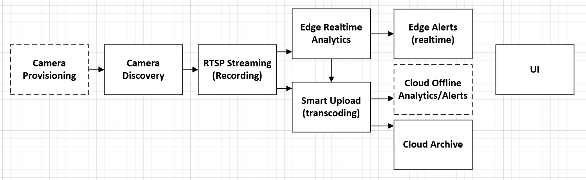
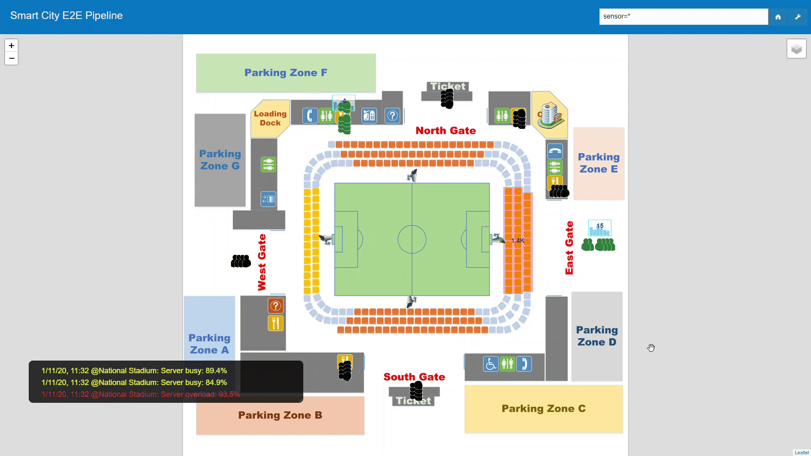
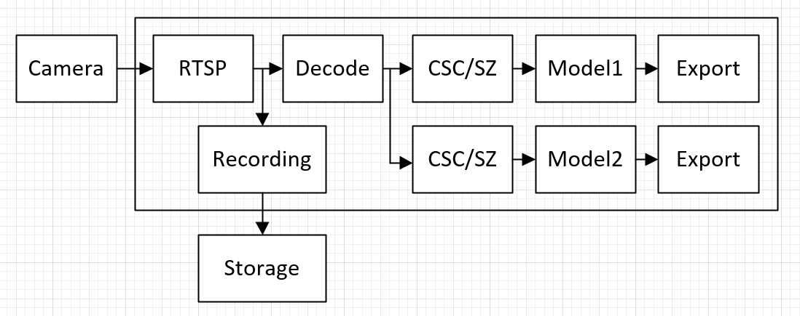
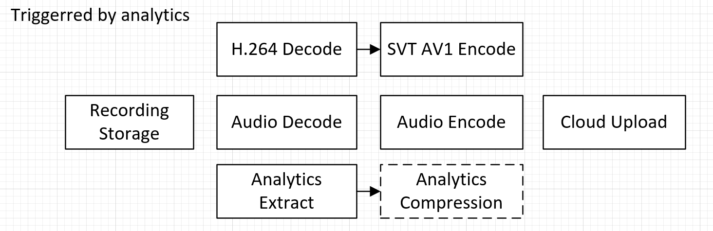

The E2E sample implements aspects of smart city sensing, analytics and management features as follows:   



- **Camera Provisioning**: Tag and calibrate cameras for installation locations, calibration parameters and other usage pattern information.   
- **Camera Discovery**: Discover and register IP cameras on specified IP blocks. Registered cameras automatically participate into the analytics activities. See [Sensor Simulation and Discovery](sensor/README.md) for additional details.    
- **Recording**: Record and manage segmented camera footage for preview or review (at a later time) purpose.     
- **Analytics**: Perform analytics on the live/recorded camera streams. Latency-sensitive analytics are performed on Edge while others are on cloud.     
- **Triggers and Alerts**: Manage triggers on analytics data. Respond with actions on triggered alerts.   
- **Smart Upload and Archive**: Transcode and upload only critical data to cloud for archival or further offline analysis.    
- **Stats**: Calculate statistics for planning/monitoring purpose on analytical data.    
- **UI**: Present above data to users/administrators/city planners.     

### Scenarios

The sample implements the Smart-City [`traffic`](https://github.com/OpenVisualCloud/Smart-City-Sample/wiki/Smart-City:-Traffic-Scenario) and [`stadium`](https://github.com/OpenVisualCloud/Smart-City-Sample/wiki/Smart-City:-Stadium-Scenario) scenarios. The [`traffic`](https://github.com/OpenVisualCloud/Smart-City-Sample/wiki/Smart-City:-Traffic-Scenario) scenario measures vehicle/pedestrian flow for planning purpose. The [`stadium`](https://github.com/OpenVisualCloud/Smart-City-Sample/wiki/Smart-City:-Stadium-Scenario) scenario focuses on different access control techniques, including entrance people counting, service-point queue counting, and stadium seating zone crowd counting.   

| Traffic | Stadium |
|:-------:|:-------:|
|</IMG>|</IMG>|

### Software Stacks

The sample is powered by the following Open Visual Cloud software stacks:      
- **Edge Low-latency Analytics**:   
  - [The GStreamer-based media analytics stack](https://github.com/OpenVisualCloud/Dockerfiles/tree/master/Xeon/ubuntu-18.04/analytics/gst) is used for object detection, people-counting, queue-counting and crowd-counting on camera streams. The software stack is optimized for [Intel® Xeon® Scalable Processors](https://github.com/OpenVisualCloud/Dockerfiles/tree/master/Xeon/ubuntu-18.04/analytics/gst) and [Intel VCAC-A](https://github.com/OpenVisualCloud/Dockerfiles/tree/master/VCAC-A/ubuntu-18.04/analytics/gst).  
 


- **Smart Upload with Transcoding**:
  - [The FFmpeg-based media transcoding stack](https://github.com/OpenVisualCloud/Dockerfiles/tree/master/Xeon/centos-7.6/media/ffmpeg) is used to transcode recorded content before uploading to cloud. The software stack is optimized for [Intel Xeon Scalable Processors](https://github.com/OpenVisualCloud/Dockerfiles/tree/master/Xeon/centos-7.6/media/ffmpeg).  



### Install Prerequisites:

- **Time Zone**: Check that the timezone setting of your host machine is correctly configured. Timezone is used during build. If you plan to run the sample on a cluster of machines managed by Docker Swarm or Kubernetes, please make sure to synchronize time among the manager/master node and worker nodes.    

- **Build Tools**: Install `cmake`, `m4` and `gawk` if they are not available on your system.        

- **Docker Engine**:        
  - Install [docker engine](https://docs.docker.com/install). Make sure you [setup](https://docs.docker.com/install/linux/linux-postinstall) docker to run as a regular user.   
  - Setup [docker swarm](https://docs.docker.com/engine/swarm), if you plan to deploy through docker swarm. See [Docker Swarm Setup](deployment/docker-swarm/README.md) for additional setup details.  
  - Setup [Kubernetes](https://kubernetes.io/docs/setup), if you plan to deploy through Kubernetes. See [Kubernetes Setup](deployment/kubernetes/README.md) for additional setup details.     
  - Setup docker proxy as follows if you are behind a firewall:   

```bash
sudo mkdir -p /etc/systemd/system/docker.service.d       
printf "[Service]\nEnvironment=\"HTTPS_PROXY=$https_proxy\" \"NO_PROXY=$no_proxy\"\n" | sudo tee /etc/systemd/system/docker.service.d/proxy.conf       
sudo systemctl daemon-reload          
sudo systemctl restart docker     
```

### Build Sample: 

Use the following commands to build the sample. By default, the sample builds to the `traffic` scenario. To enable the `stadium` scenario, use `cmake -DSCENARIO=stadium ..`. See also: [Build Options](doc/cmake.md).    

```bash
mkdir build    
cd build     
cmake ..    
make     
```

### Start/stop Sample: 

Use the following commands to start/stop services via docker swarm:    

```bash
make update # optional for private registry
make start_docker_swarm      
make stop_docker_swarm      
```

See also:  [Docker Swarm Setup](deployment/docker-swarm/README.md).    

Use the following commands to start/stop Kubernetes services:

```
make update # optional for private registry
make start_kubernetes
make stop_kubernetes
```

See also: [Kubernetes Setup](deployment/kubernetes/README.md).    

### Launch Sample UI:

Launch your browser and browse to ```https://<hostname>``` for the sample UI. 

---

* For Kubernetes/Docker Swarm, ```<hostname>``` is the hostname of the manager/master node.
* If you see a browser warning of self-signed certificate, please accept it to proceed to the sample UI.    
  
---

### See Also

- [Configuration Options](doc/cmake.md)          
- [Docker Swarm Setup](deployment/docker-swarm/README.md)      
- [Kubernetes Setup](deployment/kubernetes/README.md)
- [Intel VCAC-A Setup](doc/vcac-a.md)

