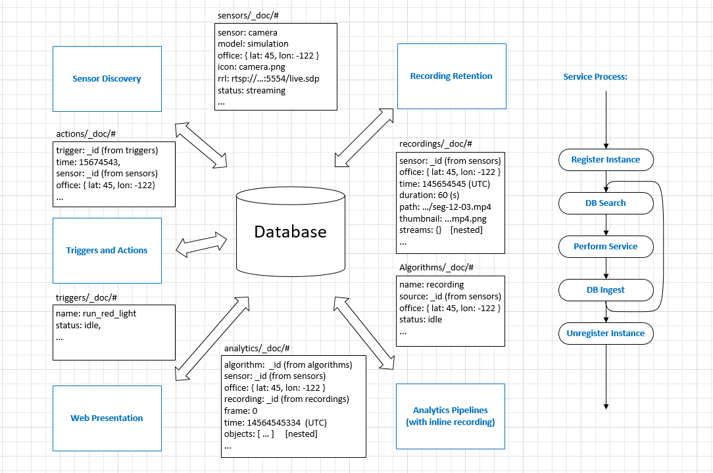

The E2E sample implements aspects of smart city sensing, analytics and management features as follows:   


- **Camera Provisioning**: Tag and calibrate cameras for installation locations, calibration parameters and other usage pattern information.   
- **Camera Discovery**: Discover and register IP cameras on specified IP blocks. Registered cameras automatically participate into the analytics activities. See [Sensor README](sensor/README.md) for additional details.    
- **Recording**: Record and manage segmented camera footage for preview or review (at a later time) purpose.     
- **Analytics**: Perform analytics on the live/recorded camera streams. Latency-sensitive analytics are performed on Edge while others are on cloud.     
- **Triggers and Alerts**: Manage triggers on analytics data. Respond with actions on triggered alerts.   
- **Smart Upload and Archive**: Transcode and upload only critical data to cloud for archival or further offline analysis.    
- **Stats**: Calculate statistics for planning/monitoring purpose on analytical data.    
- **UI**: Present above data to users/administrators/city planners.     

The sample showcases the following pipeline operations using the Open Visual Cloud software stacks:      
- **Edge Low-latency Analytics**:   


- **Smart Upload with Transcoding**:


The following diagram illustrates how the sample is constructed: a set of services each retrieves the work order by querying the database and submits the processing results back into the database. See also [content search](doc/search.md).          



### Install docker engine:        

(1) Install [docker engine](https://docs.docker.com/install).     
(2) Install [docker compose](https://docs.docker.com/compose/install), if you plan to deploy through docker compose. Version 1.20+ is required.    
(3) Setup [docker swarm](https://docs.docker.com/engine/swarm), if you plan to deploy through docker swarm. See [docker swarm setup](deployment/docker-swarm/README.md) for additional setup details.  
(4) Setup [Kubernetes](https://kubernetes.io/docs/setup), if you plan to deploy through Kubernetes. See [Kubernetes setup](deployment/kubernetes/README.md) for additional setup details.     

### Setup docker proxy:

```bash
(4) sudo mkdir -p /etc/systemd/system/docker.service.d       
(5) printf "[Service]\nEnvironment=\"HTTPS_PROXY=$https_proxy\" \"NO_PROXY=$no_proxy\"\n" | sudo tee /etc/systemd/system/docker.service.d/proxy.conf       
(6) sudo systemctl daemon-reload          
(7) sudo systemctl restart docker     
```

### Build docker images: 

```bash
(1) mkdir build    
(2) cd build     
(3) cmake ..    
(4) make     
```
See also how to customize the building process with [cmake options](doc/cmake.md).    

### Start/stop services:

Use the following commands to start/stop services via docker swarm:    
```bash
(1) make start_docker_swarm      
(2) make stop_docker_swarm      
```
See also how to setup [docker swarm](deployment/docker-swarm/README.md).    

Use the following commands to start/stop services via docker-compose:        
```bash
(1) make start_docker_compose      
(2) make stop_docker_compose      
```

Use the following commands to start/stop Kubernetes services:
```
(1) make update
(2) make start_kubernetes
(3) make expose_service
(4) make stop_kubernetes
```

### Launch browser:

Launch your browser and point to `https://<host-ip>`. Note that if you see a browser warning of self-signed certificate, please accept it to proceed to the sample UI.    

</IMG>    
  
### See Also

- [CMake Options](doc/cmake.md)          
- [Docker Swarm Setup](deployment/docker-swarm/README.md)      
- [Kubernetes Setup](deployment/kubernetes/README.md)
- [Sensor Simulation and Discovery](sensor/README.md)  
- [Search Capabilities](doc/search.md)       
- [Utility Scripts](doc/script.md)       
